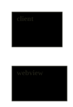
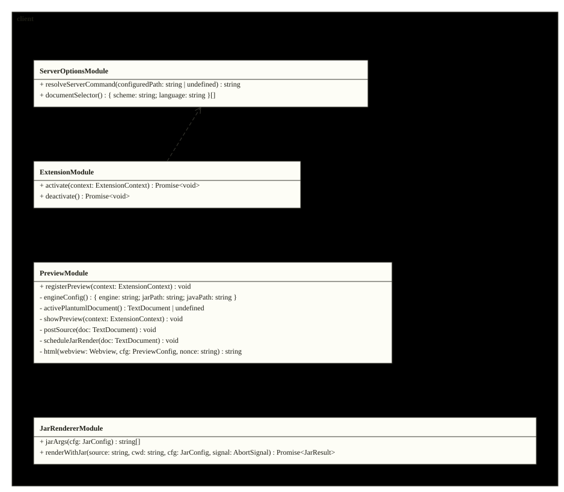
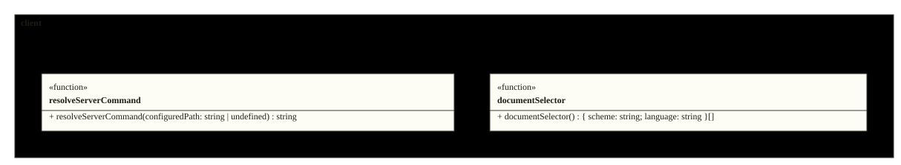
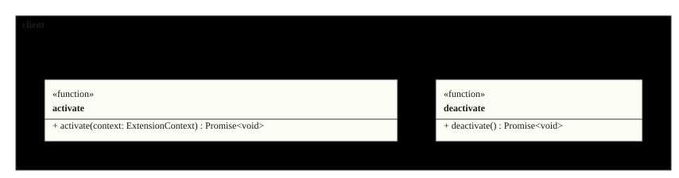
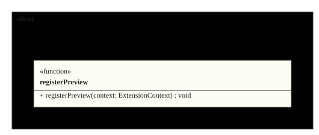
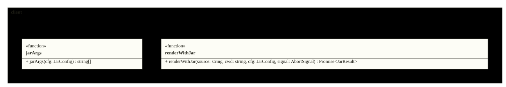
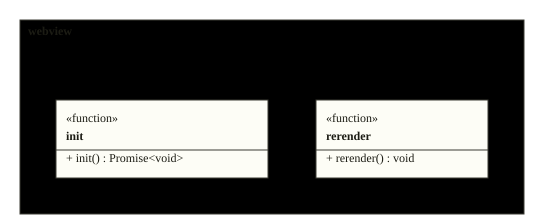
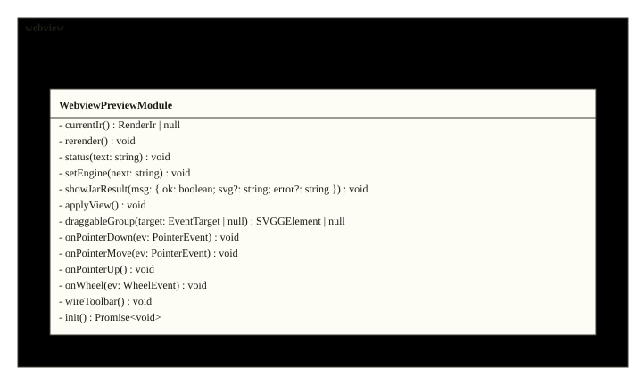

# Architecture

The extension splits into the client (activation, server options, the
jar renderer, the preview panel) and the webview (the wasm grammar plus
the render engine and the interaction shell). The figures below are the
repository's actual design, rendered from its sources on every inject.

<!-- folio: design --assets assets -->
### System view

#### HLD_PlantumlVscode

_hld · `design/hld/HLD_PlantumlVscode.puml`_

- traces to: `SREQ-00001-1`

### Module overview

#### CL_Client

_cl · `design/lld/client/CL_Client.puml`_

- traces to: `REQ-00001-1` `REQ-00002-1` `REQ-00003-1` `REQ-00004-1` `REQ-00006-1` `REQ-00007-1`
- verified by: `tests/jarRenderer.test.ts` (2) · `tests/manifest.test.ts` (2) · `tests/preview.test.ts` (2) · `tests/serverOptions.test.ts` (2)

### Class detail

<code>CL_ServerOptions</code> · traces to <code>REQ-00002-1</code>

<ul>
<li>source: <code>design/lld/client/CL_ServerOptions.puml</code></li>
<li>verified by: <code>tests/serverOptions.test.ts</code> (2)</li>
</ul>

<code>CL_Extension</code> · traces to <code>REQ-00001-1</code> <code>REQ-00003-1</code>

<ul>
<li>source: <code>design/lld/client/CL_Extension.puml</code></li>
<li>verified by: <code>tests/manifest.test.ts</code> (1)</li>
</ul>

<code>CL_Preview</code> · traces to <code>REQ-00004-1</code> <code>REQ-00007-1</code>

<ul>
<li>source: <code>design/lld/client/CL_Preview.puml</code></li>
<li>verified by: <code>tests/manifest.test.ts</code> (1), <code>tests/preview.test.ts</code> (2)</li>
</ul>

<code>CL_JarRenderer</code> · traces to <code>REQ-00006-1</code>

<ul>
<li>source: <code>design/lld/client/CL_JarRenderer.puml</code></li>
<li>verified by: <code>tests/jarRenderer.test.ts</code> (2)</li>
</ul>

### Module overview

#### CL_Webview

_cl · `design/lld/webview/CL_Webview.puml`_

- traces to: `REQ-00004-1` `REQ-00005-1`
- verified by: `tests/preview.test.ts` (2)

### Class detail

<code>CL_WebviewPreview</code> · traces to <code>REQ-00004-1</code> <code>REQ-00005-1</code>

<ul>
<li>source: <code>design/lld/webview/CL_WebviewPreview.puml</code></li>
<li>verified by: <code>tests/preview.test.ts</code> (2)</li>
</ul>

<!-- /folio -->
